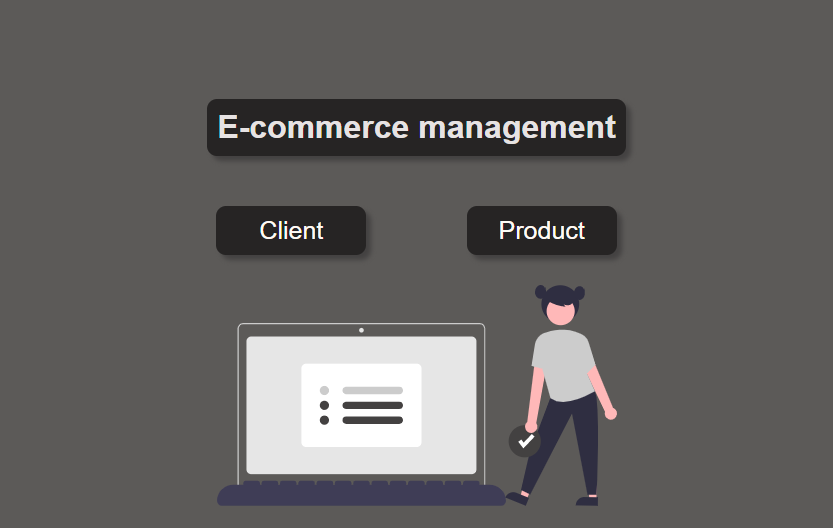
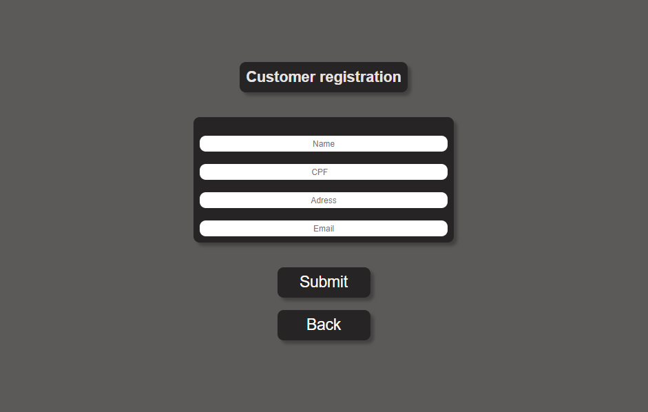
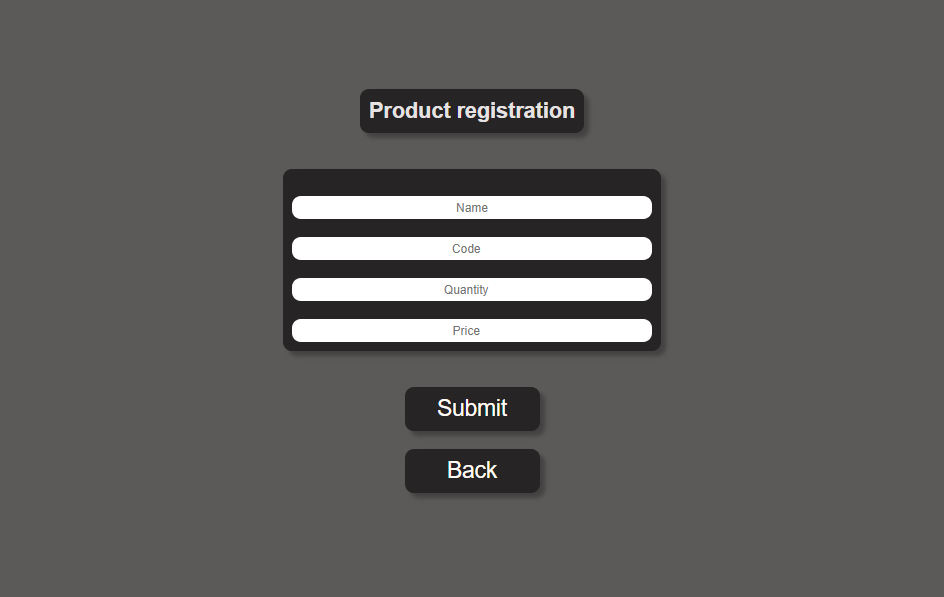

# E-management

This project is the second challenge from Hiring-Coders. 

# What i should make ?

2nd Delivery - Registration Management

-Creating an e-commerce system for product inventory and customer data:

Deliverables:

-Customer, address and product data must be properly structured
-Data without local storage
-Source code on github with README file detailing programming functionality

I added other functions like, validate the email and the quantity of the product because you can't add nothing or a negative number.

This was the result [site](https://e-management.netlify.app)

# Preview 🖥️

